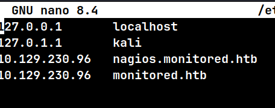

## Machine Overview

Legacy is a beginner-friendly Windows machine that demonstrates the impact of unpatched systems. This machine is vulnerable to several critical SMB exploits including MS08-067 and MS17-010 (EternalBlue).

**Target Details:**
- **IP Address:** `10.129.230.96 `
- **Operating System:** Linux
- **Difficulty:** Easy




## Initial Reconnaissance

### Port Scanning

Starting of with an Nmap TCP scan

```bash
sudo nmap -sC -sV -p- -T4 10.129.230.96 
```


**Results:**


Relevant ports open:

```bash
Port 80: http
port 22: ssh
port 389: ldap `OpenLDAP 2.2.X - 2.3.X`
Port 443: HTTP: Apache httpd 2.4.56, NagiosXI
```

Next did a Nmap UDP Scan

```
sudo nmap -sU --top-ports 100 -sV -T3 -Pn -n 10.129.230.96
```

Relevant ports open:

```
port 161: SNMPv1 server; net-snmp SNMPv3 server (public)
Port 162: net-snmp; net-snmp SNMPv3 server
```


----

### SNMP Enumeration

Used  [snmp.sh](https://github.com/Yelodash/Snmp.sh) a custom script that I made to facilitate SNMP enumeration:

```
snmp.sh -t 10.129.230.96 -c public --extras 
```


``

found these credentials but was not able to login via SSH:

```
user: svc
password: XjH7VCehowpR1xZB
```


----

### HTTP Enumeration

